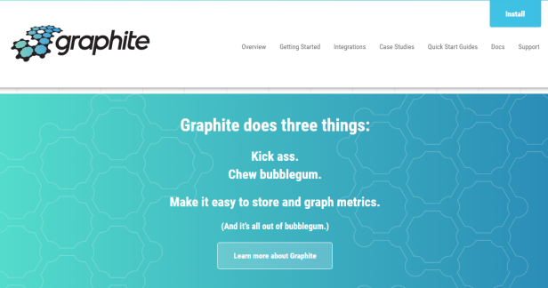
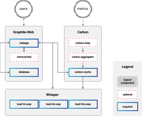
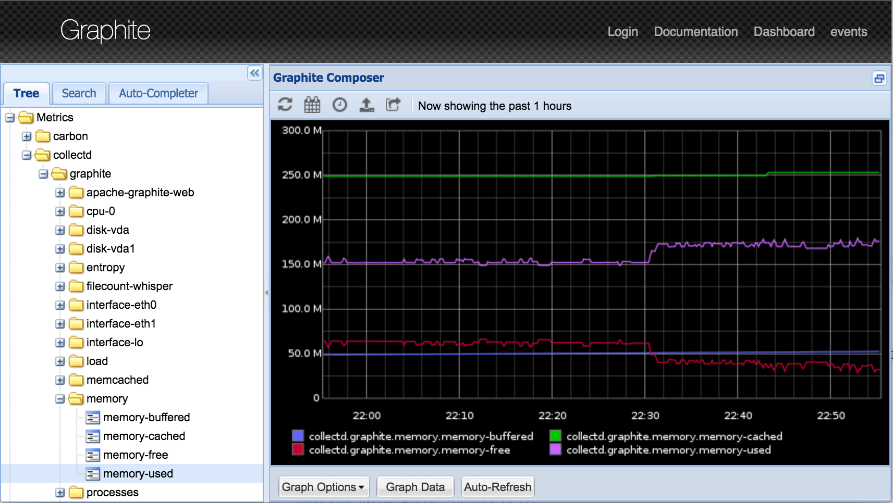
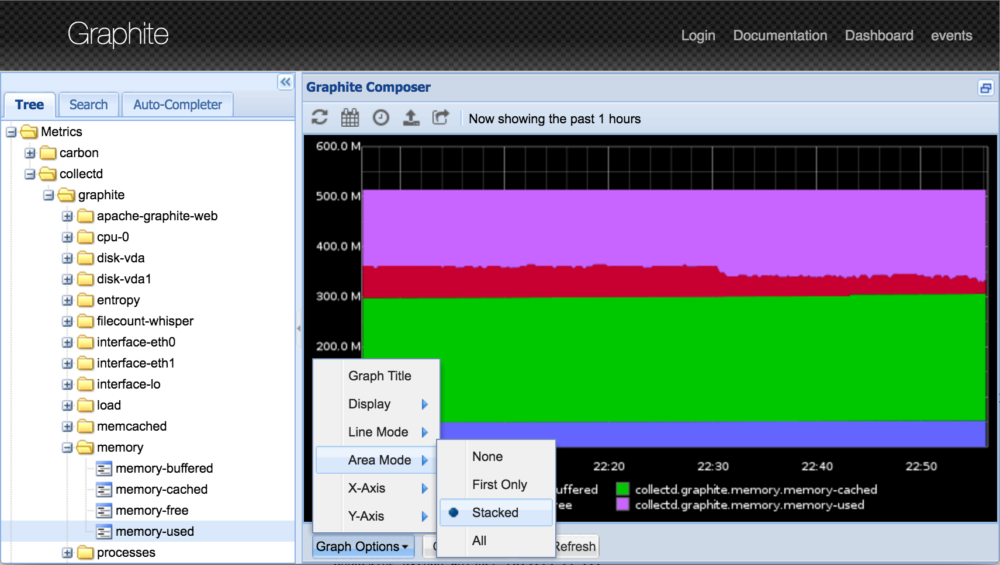
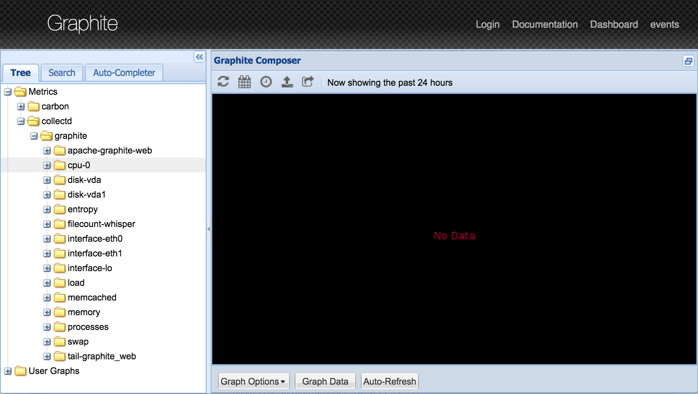

### Introduction

<code>Graphite</code> is a graphing library made up of several components that can be used to render visual representations of your data over time and can show you statistics/metrics about that data.

### Why do we collect data statistics & metrics?

There are plenty of reasons why collecting stats about your servers, applications, and traffic is a good idea.

<ul>
<li>
Collecting and organizing data can give you confidence in your decisions about scaling, troubleshooting, and tracking down pain-points in your configurations. 
</li>

<li>
The more data we have, the more likely we will be able to understand what is happening at any given moment. 
</li>

<li>

Most logging systems today are unable to correlate data from various applications and are also unable to represent it efficiently. 
</li>
</ul>

### Graphite

Graphite is an enterprise-ready monitoring tool that runs equally well on cheap hardware or Cloud infrastructure.

Teams use Graphite to track the performance of their websites, applications, business services, and networked servers.

It marked the start of a new generation of monitoring tools, making it easier than ever to store, retrieve, share, and visualize time-series data.

Apart from that, it does following things as well! (According to Graphite folks, not me!)

### Architecture 

Graphite consists of `three` software components:

 

<ol type="1">
<li>

<code>carbon</code> - a high-performance service that listens for time-series data
</li>

<li>

<code>whisper</code> - a simple database library for storing time-series data
</li>

<li>

<code>graphite-web</code> - Graphite's user interface & API for rendering graphs and dashboards
</li>
</ol>

Metrics get fed into the stack via the Carbon service, which writes the data out to Whisper databases for long-term storage. Users interact with the Graphite web UI or API, which in turn queries Carbon and Whisper for the data needed to construct the requested graphs.

### Installation

You can read about Graphite installation using <code>Synthesize Script</code> in detail from <a href="http://graphiteapp.org/quick-start-guides/synthesize.html">HERE</a>.

Synthesize is a fully automated installation and configuration script for the Graphite stack.

### Getting Matrics in Graphite

There is a detailed explanation of how to get your own metrics into Graphite <a href="http://graphiteapp.org/quick-start-guides/feeding-metrics.html">HERE</a>.

Also, you can find a lot of detailed information about the same on <a href="http://graphite.readthedocs.io/en/latest/overview.html">Graphite Docs</a>

 
`Here's how the Graphite Web UI looks on my machine!`

I will be uploading my tutorial on the same very soon. Till then you can get the know-how of getting data; or to be more specific, getting Matrics into the Graphite Stack from the above-mentioned links.
