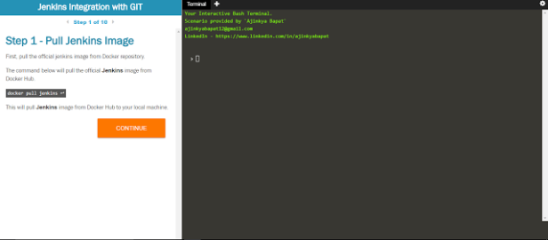

Want to learn `Docker`?

Want to learn `Jenkins`?

Want to learn `Git`?

Want to learn `Continuous Integration`?

Want to learn all of them without *actually* messing up with your system! ??

Well, then you are at the right place & probably at the right time!

I have created a **Hands-on Lab Tutorial** for you.

You can access it on below link:

Hands-on Tutorial - Jenkins Integration with GIT for CI

 
This tutorial will guide you through:

1. Jenkins Installation on Docker

2. Jenkins Configuration

3. Git Basics

4. Git Commands

5. CI using Jenkins-Git

 
Here's a screenshot of the tutorial:

You can also try any other Docker commands, Git Commands, Jenkins Jobs in the Lab Environment.

 
Share it with others and let me know your suggestions, comments in the comment box below.