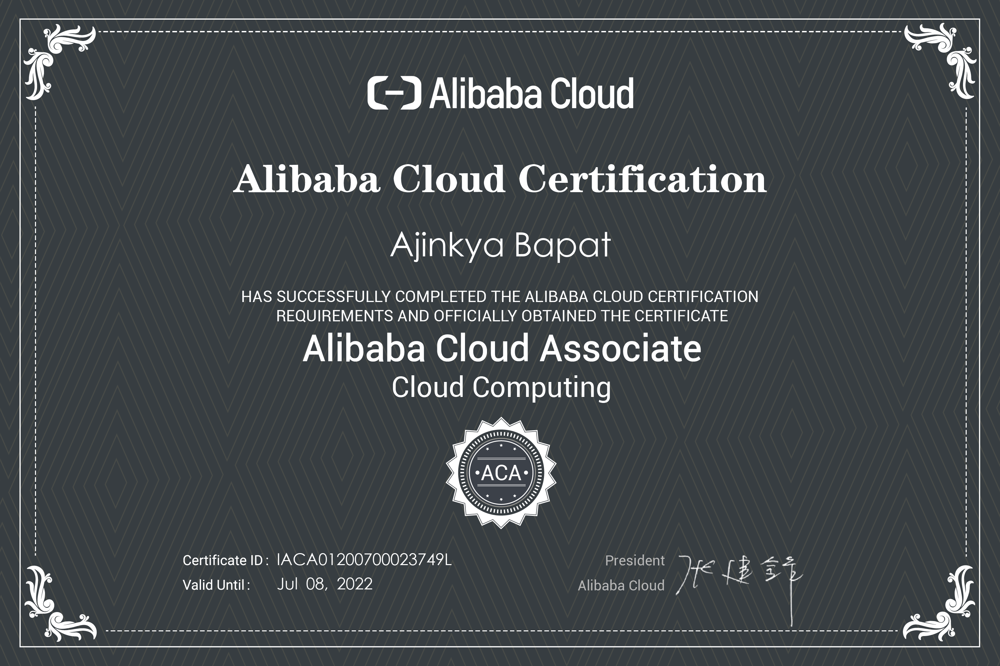

Recently, I sat for the <code>Alibaba Cloud Associate</code> exam and Passed it. Here's my experience about the whole process, importance of the exam, and<b> my personal notes </b> that I took while prepping for the exam.

 
### About Alibaba Cloud

Alibaba Cloud, founded in 2009, is a global leader in cloud computing and artificial intelligence, providing services to thousands of enterprises, developers, and governments organizations in more than 200 countries and regions.

According to <b>Gartner</b>, Alibaba Cloud ranks <b>1st</b> among cloud service providers in <b>Asia Pacific</b>, with a <b>19.6%</b> market share and ranks <b>3rd</b> among cloud service providers in terms of market share in the world.

To learn more about Alibaba Cloud, check out <a href="https://www.alibabacloud.com/about">this link</a>.

 
### About ACA Certification

Alibaba Cloud Certification Associate <b>(ACA)</b> is a certification designed for personnel who can use Alibaba Cloud Computing products. It covers all of Alibaba Cloud's core products from computing, storage, networking to security.

> ACA Certification acts as a foundational certification & is a basis for the <code>Professional</code> & <code>Expert</code> Certifications.

You can know more about their certification programs & can enroll for the ACA Certification from <a href="https://edu.alibabacloud.com/certification">HERE</a>.

 

### Important information about ACA Exam

<ul><ul>

<li>ACA Certification exam is currently priced at <b>$120</b>. Though you can obtain a voucher to take the exam <b>free of cost!</b> by attending any of the upcoming Alibaba Cloud Events.</li>
 
<li>ACA Exam is currently available in <b>English</b> only.</li>
 
<li>Due to the pandemic COVID-19, their offline test center - Pearson VUE has currently limited or suspended their testing capacity in many countries.</li>
 
<li>Therefore, at the time of writing this post, Alibaba Cloud is offering an interim solution by allowing candidates to take their certification exam at home via <b>Zoom video meeting</b> to accomplish online proctoring.</li>
 
<li>You will have <b>90 minutes</b> to complete the exam. If you do not pass the exam, and if you want to take the same certification exam again, you must have at least <b>14 days</b> gap between the 2 exams.</li>
 
<li>When you submit your exam, you will see the exam score <b>immediately</b>. If you pass the exam, please fill in your name to generate the certificate, be careful as once your name is submitted, it <b>cannot be modified</b>.</li>

</ul></ul>

### My Experience & Preparation Tips

 I sat for the exam on <b>9th of July, 2020</b>. I got my result & certification immediately after I submitted my exam.
 

To do well in the exam you should:

<ul><ul>
<li>Take their <a href="https://edu.alibabacloud.com/certification/clouder_acacloudcomputing">Cloud Computing Exam Preparation Course</a> which covers everything that is required to prepare for the exam.</li>

<li>The same course is available on <a href="https://www.coursera.org/learn/alibaba-cloud-computing">Coursera</a> as well.</li>

<li>Focus on the labs that they do in every section of the course.</li>

<li>You can refer to my <b>notes</b> which I took from all of the resources mentioned above.</li>

<li>Doing all of the things mentioned above should be sufficient for you to rock your ACA Exam!</li>
</ul></ul>

> I hope you find this post useful in order for you to clear the exam. Wish you the very best with your ACA Exam!

 

### Notes

<iframe src="../assets/pdf/AlibabaACANotesByAjinkya.pdf" width="100%" height="800rem"></iframe>
