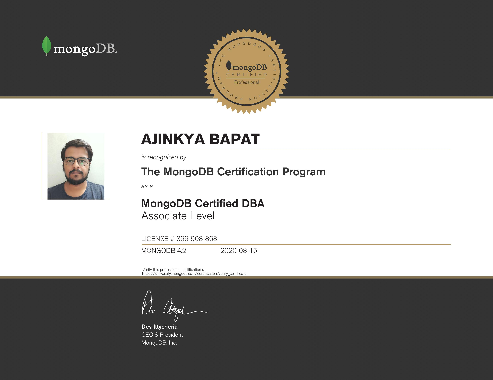
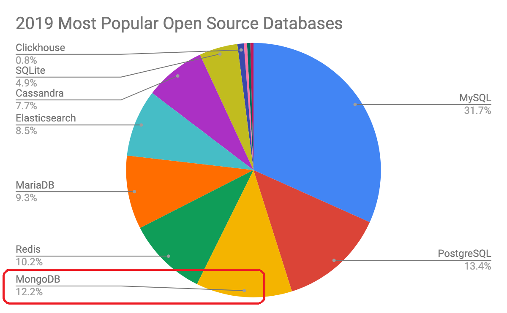

Recently, I sat for the <code>MongoDB Certified DBA (C100DBA)</code> exam and Passed it. Here's my experience about the whole process, importance of the exam, and<b> my personal notes </b> that I took while prepping for the exam.

For simplification, I have divided this post into 2 parts. This part contains all the general information about MongoDB, their Certifications, Exam format, etc. 

Part 2 of this series will contain Exam tips, study materials for the C100DBA Exam. Stay tuned for the 2nd Part! 

 

### About MongoDB

<a href="https://www.mongodb.com/">MongoDB</a> is an <b>open-source document database</b> built on a horizontal scale-out architecture. Founded in 2007, MongoDB has a worldwide following in the developer community.

Instead of storing data in tables of rows or columns like SQL databases, each row in a MongoDB database is a document described in <b>JSON</b>, a formatting language.

According to the survey conducted by <code>Scalegrid.io</code>, MongoDB ranks <b>3rd</b> among Most popular Open Source Databases & <b>1st</b> among Most Popular NoSQL Databases for year 2019.

You can learn more about the Survey & check where does MongoDB stands infront of its competitors by visiting this <a href="https://scalegrid.io/blog/2019-open-source-database-report-top-databases-public-cloud-vs-on-premise-polyglot-persistence/">Survey Page</a>.

 

### SQL vs MongoDB

The differences between MongoDB and traditional SQL-based databases are fundamental. When you use <b>Postgres</b>, <b>MySQL</b>, or <b>SQL Server</b> to power a project, you store data in a set of tables that often cross-reference one another to maintain relationships between data points.

MongoDB, on the other hand, doesn’t maintain these relationships. It’s a <b>non-relational</b> database, and anything you want to know about a record needs to be contained within that record itself. That said, you can choose to include data models and linking fields in your collections when creating them, but it’s up to you to enforce those models and keep links working between your MongoDB collections.

 

### MongoDB Certifications

<ul><ul>

<li>MongoDB certifications recognize developers and DBAs with the knowledge needed to build and maintain MongoDB applications. </li>
 
<li>MongoDB University provides 2 kinds of MongoDB Certifications: <b>Developer Associate</b> & <b>DBA Associate</b></li>
 
<li>The <code>MongoDB Certified DBA Associate Level Exam</code> is for administrators with knowledge of the concepts and mechanics of MongoDB.</li>
 
<li>The <code>MongoDB Certified Developer Associate Level Exam</code> is intended for individuals with knowledge of the fundamentals of designing and building applications using MongoDB.</li>
 
<li>Both of these Exams require you to have General IT Knowledge like <b>Fundamental database concepts</b>, <b>Fundamentals of system programming</b> & <b>Basic JavaScript programming</b>.</li>
 
<li>MongoDB currently offers certifications at the <b>Associate Level</b> for the DBA and Developer roles. Certification at other levels will be available in the future.</li>
 
<li>MongoDB certifications align to a specific MongoDB major release and they remain valid for that version.</li>
 
<li>Exam cost for both the exams is <b>150.00 USD per attempt</b> without any Free Retake of the exam. </li>
</ul></ul>

### Exam Format & Grading

<ul><ul>
<li>MongoDB certification exams are delivered online using a web proctoring solution(Examity).</li>

<li>You have <b>90 minutes</b> to complete an exam.</li>

<li>There are <b>60</b> Multiplce Choice & Check all that apply kind of questions.</li>

<li>Score Required to Pass is <b>490 points out of 600</b>.</li>

<li>There is <b>no penalty</b> for incorrect answers.</li>

</ul></ul>

### MongoDB Free Certification

<ul><ul>
<li>In the month of March, 2020, MongoDB announced their partnership with <b>GitHub & GitHub Education</b>. </li>

<li>Hence, MongoDB is now part of the <a href="https://www.mongodb.com/students">GitHub Student Developer Pack</a>.</li>

<li>All of MongoDB University training courses - from beginner to advanced - are completely free under the program.</li>

<li>You will get a <b>FREE CERTIFICATION VOUCHER</b> when you complete one of the suggested <a href="https://www.mongodb.com/blog/post/get-started-with-mongodb-university-learning-paths">learning paths</a>.</li>

<li>You will also get $200 in MongoDB Atlas Credits. MongoDB Atlas is the global cloud database service for applications built on MongoDB.</li>

<li>To apply and find more information, you can visit <a href="https://www.mongodb.com/students">this page</a>. </li>

</ul></ul>

### C100 DBA Exam Tips & Notes

Stay tuned for the Part 2 of this MongoDB Certification Preparation series in which I will write about preaparation tips, study material & much more! 

